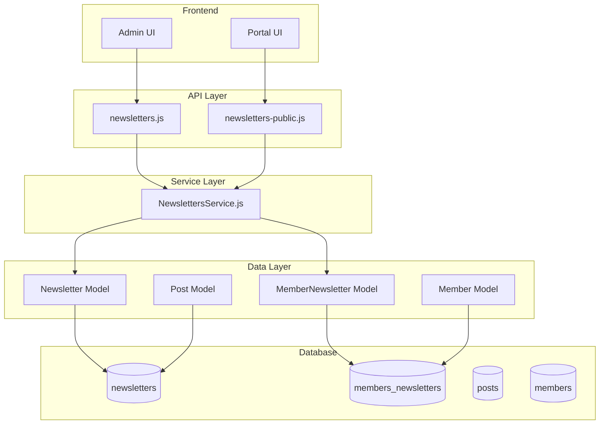
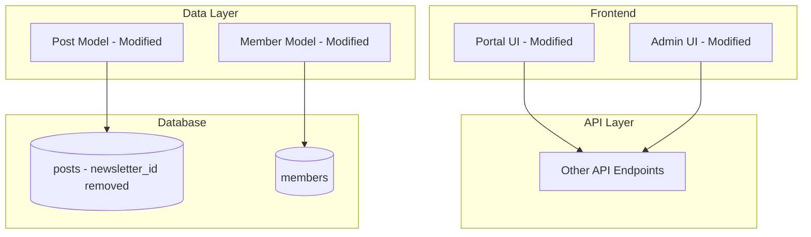

# Design Document: Remove Newsletter Feature

## Overview

This document outlines the design for completely removing the newsletter functionality from the Ghost publishing platform. The newsletter feature is deeply integrated across multiple layers of the application, requiring careful systematic removal to maintain application stability.

The removal affects:
- Backend services (`core/server/services/newsletters/`)
- Data models (`newsletter.js`, `member-newsletter.js`)
- API endpoints (admin and public)
- Database schema (2 tables: `newsletters`, `members_newsletters`)
- 20+ database migrations
- Admin UI components
- Portal (frontend) membership components
- Post model (has `newsletter_id` foreign key)

## Architecture

### Current Architecture



### Target Architecture (Post-Removal)



## Components and Interfaces

### Components to Remove

| Component | Path | Type |
|-----------|------|------|
| Newsletter Service | `core/server/services/newsletters/` | Directory |
| Newsletter Model | `core/server/models/newsletter.js` | File |
| MemberNewsletter Model | `core/server/models/member-newsletter.js` | File |
| Newsletter API | `core/server/api/endpoints/newsletters.js` | File |
| Newsletter Public API | `core/server/api/endpoints/newsletters-public.js` | File |
| Newsletter Mapper | `core/server/api/endpoints/utils/serializers/output/mappers/newsletters.js` | File |
| Newsletter Migrations | `core/server/data/migrations/versions/*/\*newsletter*` | Multiple Files |

### Components to Modify

| Component | Path | Changes Required |
|-----------|------|------------------|
| API Index | `core/server/api/endpoints/index.js` | Remove newsletter exports |
| Mapper Index | `core/server/api/endpoints/utils/serializers/output/mappers/index.js` | Remove newsletter mapper |
| Schema | `core/server/data/schema/schema.js` | Remove newsletters and members_newsletters tables |
| Member Model | `core/server/models/member.js` | Remove newsletter relationships |
| Post Model | `core/server/models/post.js` | Remove newsletter_id reference |
| Portal Components | `apps/portal/src/` | Remove newsletter UI elements |
| Admin Settings | `apps/admin-x-settings/` | Remove newsletter settings |

## Data Models

### Tables to Remove

#### newsletters
```javascript
{
    id: string(24),
    uuid: string(36),
    name: string(191),
    description: string(2000),
    feedback_enabled: boolean,
    slug: string(191),
    sender_name: string(191),
    sender_email: string(191),
    sender_reply_to: string(191),
    status: string(50),
    visibility: string(50),
    subscribe_on_signup: boolean,
    sort_order: integer,
    // ... 30+ additional columns for styling
    created_at: dateTime,
    updated_at: dateTime
}
```

#### members_newsletters
```javascript
{
    id: string(24),
    member_id: string(24), // FK to members.id
    newsletter_id: string(24) // FK to newsletters.id
}
```

### Columns to Remove from Other Tables

#### posts
- `newsletter_id`: Foreign key reference to newsletters table

## Correctness Properties

*A property is a characteristic or behavior that should hold true across all valid executions of a system-essentially, a formal statement about what the system should do. Properties serve as the bridge between human-readable specifications and machine-verifiable correctness guarantees.*

Based on the prework analysis, the following correctness properties must be validated:

### Property 1: API Endpoint Removal Completeness
*For any* HTTP request to a former newsletter API endpoint (e.g., `/ghost/api/admin/newsletters/`, `/ghost/api/content/newsletters/`), the system should return a 404 Not Found response.
**Validates: Requirements 2.1**

### Property 2: Member Data Integrity After Removal
*For any* member record that existed before newsletter removal, the member's core data (id, email, name, status, subscriptions) should remain intact and queryable after the removal process.
**Validates: Requirements 7.1, 7.2**

### Property 3: Post Data Integrity
*For any* post record that had a newsletter_id before removal, the post should remain accessible and all non-newsletter fields should be preserved.
**Validates: Requirements 3.3, 7.3**

## Error Handling

### Migration Handling
- Existing newsletter migrations should be removed or marked as no-ops
- A new migration should be created to drop newsletter tables if they exist
- Foreign key constraints must be handled before table drops

### Import Error Prevention
- All files importing newsletter modules must be identified and updated
- Build process should fail fast if any newsletter imports remain

### Database Query Errors
- All queries referencing newsletter tables/columns must be updated
- Member queries must not join on members_newsletters
- Post queries must not reference newsletter_id

## Testing Strategy

### Dual Testing Approach

This removal requires both unit testing and integration testing to ensure completeness.

#### Unit Tests
- Verify API index no longer exports newsletter endpoints
- Verify schema.js no longer defines newsletter tables
- Verify member model no longer has newsletter relationships

#### Property-Based Tests
Using the existing test framework (Jest/Mocha with the Ghost test utilities):

1. **API Endpoint Property Test**: Generate random newsletter-like endpoint paths and verify all return 404
2. **Member Data Integrity Test**: For a set of member records, verify all core fields are preserved after removal
3. **Post Data Integrity Test**: For a set of post records, verify all non-newsletter fields are preserved

#### Integration Tests
- Server startup test: Verify Ghost starts without newsletter modules
- Build test: Verify application compiles without newsletter-related errors
- Admin navigation test: Verify admin UI loads without newsletter routes
- Portal test: Verify membership flows work without newsletter options

### Test Execution
- Run existing Ghost test suite to catch regressions
- Add specific tests for newsletter removal verification
- Configure property-based tests to run minimum 100 iterations
