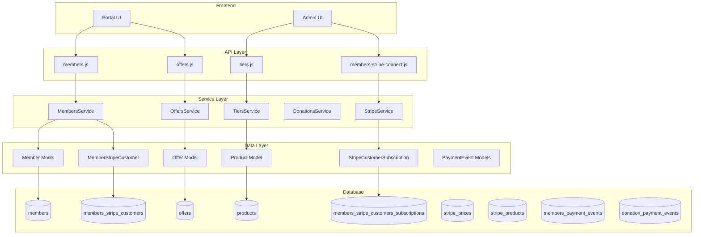
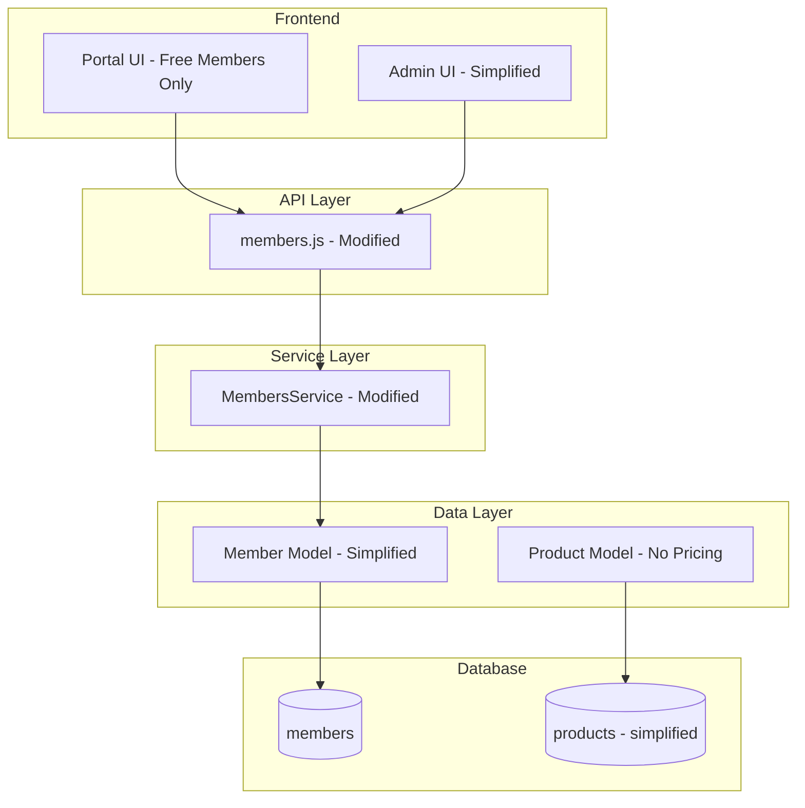

# Design Document: Remove Payment Feature

## Overview

This document outlines the design for completely removing the payment functionality from the Ghost publishing platform. The payment feature is deeply integrated across multiple layers of the application, requiring careful systematic removal to maintain application stability.

The removal affects:
- Backend services (`core/server/services/stripe/`, `services/offers/`, `services/tiers/`, `services/donations/`)
- Data models (10+ payment-related models)
- API endpoints (offers, tiers, members-stripe-connect)
- Database schema (8+ tables)
- 50+ database migrations
- Admin UI components (admin-x-settings)
- Portal (frontend) membership components

## Architecture

### Current Architecture



### Target Architecture (Post-Removal)



## Components and Interfaces

### Components to Remove

| Component | Path | Type |
|-----------|------|------|
| Stripe Service | `core/server/services/stripe/` | Directory |
| Offers Service | `core/server/services/offers/` | Directory |
| Tiers Service | `core/server/services/tiers/` | Directory |
| Donations Service | `core/server/services/donations/` | Directory |
| MemberPaymentEvent Model | `core/server/models/member-payment-event.js` | File |
| MemberStripeCustomer Model | `core/server/models/member-stripe-customer.js` | File |
| StripeCustomerSubscription Model | `core/server/models/stripe-customer-subscription.js` | File |
| StripePrice Model | `core/server/models/stripe-price.js` | File |
| StripeProduct Model | `core/server/models/stripe-product.js` | File |
| DonationPaymentEvent Model | `core/server/models/donation-payment-event.js` | File |
| Offer Model | `core/server/models/offer.js` | File |
| OfferRedemption Model | `core/server/models/offer-redemption.js` | File |
| MemberPaidSubscriptionEvent Model | `core/server/models/member-paid-subscription-event.js` | File |
| SubscriptionCreatedEvent Model | `core/server/models/subscription-created-event.js` | File |
| Offers API | `core/server/api/endpoints/offers.js` | File |
| Offers Public API | `core/server/api/endpoints/offers-public.js` | File |
| Tiers API | `core/server/api/endpoints/tiers.js` | File |
| Tiers Public API | `core/server/api/endpoints/tiers-public.js` | File |
| Stripe Connect API | `core/server/api/endpoints/members-stripe-connect.js` | File |

### Components to Modify

| Component | Path | Changes Required |
|-----------|------|------------------|
| API Index | `core/server/api/endpoints/index.js` | Remove payment endpoint exports |
| Schema | `core/server/data/schema/schema.js` | Remove payment tables |
| Member Model | `core/server/models/member.js` | Remove stripeCustomers relationship |
| Product Model | `core/server/models/product.js` | Remove Stripe pricing relationships |
| Members Service | `core/server/services/members/` | Remove payment processing |
| Portal Components | `apps/portal/src/` | Remove payment UI elements |
| Admin Settings | `apps/admin-x-settings/` | Remove payment settings |

## Data Models

### Tables to Remove

#### members_stripe_customers
```javascript
{
    id: string(24),
    member_id: string(24), // FK to members.id
    customer_id: string(255), // Stripe customer ID
    name: string(191),
    email: string(191),
    created_at: dateTime,
    updated_at: dateTime
}
```

#### members_stripe_customers_subscriptions
```javascript
{
    id: string(24),
    customer_id: string(255), // FK to members_stripe_customers.customer_id
    subscription_id: string(255), // Stripe subscription ID
    stripe_price_id: string(255),
    status: string(50),
    cancel_at_period_end: boolean,
    current_period_end: dateTime,
    start_date: dateTime,
    // ... additional subscription fields
}
```

#### stripe_products
```javascript
{
    id: string(24),
    product_id: string(24), // FK to products.id
    stripe_product_id: string(255),
    created_at: dateTime,
    updated_at: dateTime
}
```

#### stripe_prices
```javascript
{
    id: string(24),
    stripe_price_id: string(255),
    stripe_product_id: string(255), // FK to stripe_products
    active: boolean,
    currency: string(191),
    amount: integer,
    type: string(50), // recurring, one_time, donation
    interval: string(50)
}
```

#### offers
```javascript
{
    id: string(24),
    active: boolean,
    name: string(191),
    code: string(191),
    product_id: string(24), // FK to products.id
    stripe_coupon_id: string(255),
    discount_type: string(50),
    discount_amount: integer,
    // ... additional offer fields
}
```

#### offer_redemptions
```javascript
{
    id: string(24),
    offer_id: string(24), // FK to offers.id
    member_id: string(24), // FK to members.id
    subscription_id: string(24),
    created_at: dateTime
}
```

#### members_payment_events
```javascript
{
    id: string(24),
    member_id: string(24), // FK to members.id
    amount: integer,
    currency: string(191),
    source: string(50),
    created_at: dateTime
}
```

#### donation_payment_events
```javascript
{
    id: string(24),
    name: string(191),
    email: string(191),
    member_id: string(24), // FK to members.id (nullable)
    amount: integer,
    currency: string(50),
    // ... attribution fields
    created_at: dateTime
}
```

### Tables to Modify

#### products (keep but simplify)
Remove columns:
- `monthly_price_id`
- `yearly_price_id`
- `currency`
- `monthly_price`
- `yearly_price`
- `trial_days`

#### members
Remove relationship to `stripeCustomers`

## Correctness Properties

*A property is a characteristic or behavior that should hold true across all valid executions of a system-essentially, a formal statement about what the system should do. Properties serve as the bridge between human-readable specifications and machine-verifiable correctness guarantees.*

Based on the prework analysis, the following correctness properties must be validated:

### Property 1: Payment API Endpoints Return 404
*For any* HTTP request to a former payment API endpoint (e.g., `/ghost/api/admin/offers/`, `/ghost/api/admin/tiers/`, `/ghost/api/admin/members/stripe-connect/`, Stripe webhook paths), the system should return a 404 Not Found response.
**Validates: Requirements 1.4, 2.1**

### Property 2: Member Data Integrity After Removal
*For any* member record that existed before payment removal, the member's core data (id, email, name, status) should remain intact and queryable after the removal process, and member queries should execute without referencing payment join tables.
**Validates: Requirements 7.1, 7.2, 7.3**

### Property 3: Core Functionality Preserved
*For any* non-payment operation (member creation, post creation, authentication), the system should continue to function correctly after Stripe service removal.
**Validates: Requirements 1.3, 5.3**

### Property 4: Product API Response Format
*For any* product query, the API response should return product data without Stripe pricing information (no stripe_price_id, no stripe_product_id references).
**Validates: Requirements 8.1, 8.3**

## Error Handling

### Migration Handling
- Existing payment migrations should be removed or marked as no-ops
- A new migration should be created to drop payment tables if they exist
- Foreign key constraints must be handled before table drops (order: offer_redemptions → offers → subscriptions → stripe_customers → stripe_prices → stripe_products)

### Import Error Prevention
- All files importing payment modules must be identified and updated
- Build process should fail fast if any payment imports remain

### Database Query Errors
- All queries referencing payment tables/columns must be updated
- Member queries must not join on members_stripe_customers
- Product queries must not reference stripe_prices

## Testing Strategy

### Dual Testing Approach

This removal requires both unit testing and integration testing to ensure completeness.

#### Unit Tests
- Verify API index no longer exports payment endpoints
- Verify schema.js no longer defines payment tables
- Verify member model no longer has stripeCustomers relationship
- Verify product model no longer has Stripe pricing relationships

#### Property-Based Tests
Using the existing test framework (Mocha with Ghost test utilities):

1. **API Endpoint Property Test**: Generate payment-like endpoint paths and verify all return 404
2. **Member Data Integrity Test**: For a set of member records, verify all core fields are preserved after removal
3. **Core Functionality Test**: Verify member creation and authentication work without payment modules
4. **Product Response Test**: Verify product API responses don't include payment fields

#### Integration Tests
- Server startup test: Verify Ghost starts without payment modules
- Build test: Verify application compiles without payment-related errors
- Admin navigation test: Verify admin UI loads without payment routes
- Portal test: Verify free membership flows work without payment options

### Test Execution
- Run existing Ghost test suite to catch regressions
- Add specific tests for payment removal verification
- Configure property-based tests to run minimum 100 iterations
